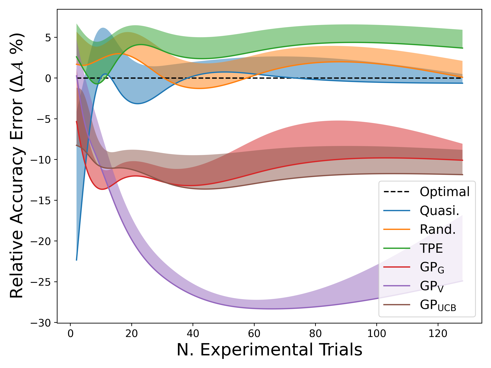
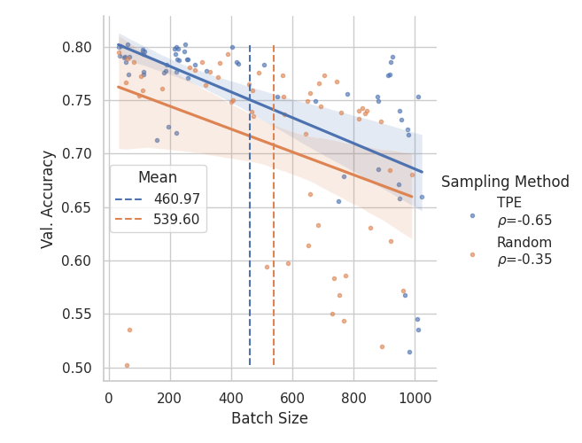

# Supplementary for `Trustworthy model evaluation on a budget`

## Requirments

Instructions based on Ubuntu 18.04 with python 3.10+


1. `git clone https://github.com/fostiropoulos/trust_ml`

2. `cd trust_ml`

3. `pip install -e .`


## Raw Data

The raw data used for our experiments:

`Dong, Xuanyi, et al. "Nats-bench: Benchmarking nas algorithms for architecture topology and size." IEEE transactions on pattern analysis and machine intelligence 44.7 (2021): 3634-3646.`

**NOTE** We provide the preprocessed dataset in [dataset.pickle](data/dataset.pickle)


https://github.com/D-X-Y/NATS-Bench


https://drive.google.com/file/d/1vzyK0UVH2D3fTpa1_dSWnp1gvGpAxRul/view?usp=sharing


You can download from command-line:
```
pip install gdown
gdown https://drive.google.com/uc?id=1vzyK0UVH2D3fTpa1_dSWnp1gvGpAxRul
```

# Reproduce

## Exp1 Analysis
`python -m trustml.exp1.main`

## Exp2 Analysis
`python -m trustml.exp2.evaluate`

# Re-Run Experiments
## NATS-Bench

To re-make the NATS-Bench dataset you can run
`python -m trustml.exp1.data`

The preprocessed dataset is saved at `data/dataset.pickle`

## Ablation of Sampler
To re-run the ablation of the sampler you can delete `data/results.pickle`

`python -m trustml.exp1.main`

## Training ResNet on CatDog Dataset

`python -m trustml.exp2.train`

